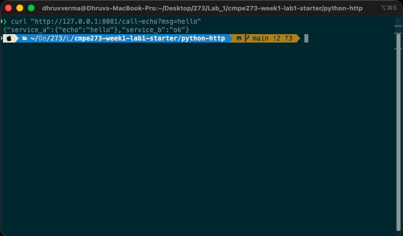
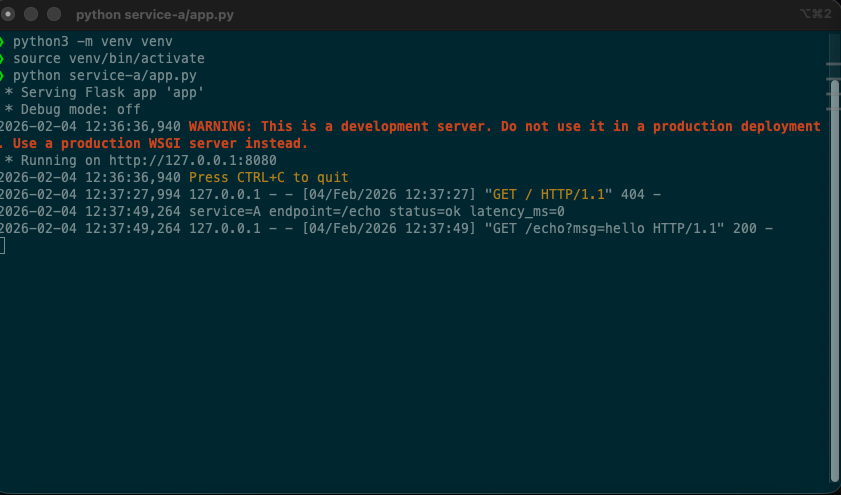
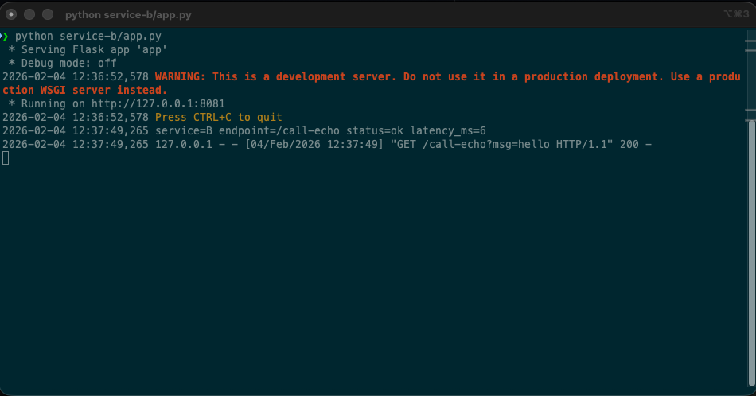
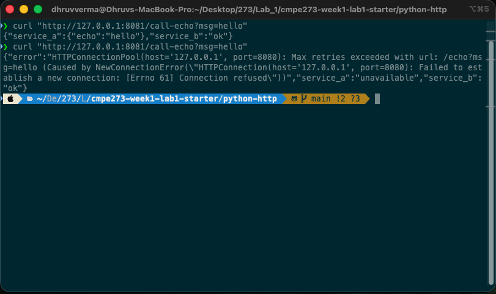
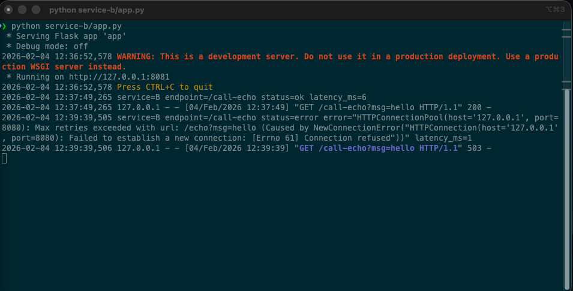

# Python HTTP Track - Distributed Services Lab

## How to Run Locally

### 1. Clone and Setup (one-time)
```bash
git clone https://github.com/dhruv12304/273_Lab1.git
cd 273_Lab1
python3 -m venv venv
source venv/bin/activate
pip install flask requests
```

### 2. Start Service A (Terminal 1)
```bash
source venv/bin/activate
python service-a/app.py
```
Service A runs on http://127.0.0.1:8080


### 3. Start Service B (Terminal 2)
```bash
source venv/bin/activate
python service-b/app.py
```
Service B runs on http://127.0.0.1:8081


### 4. Test
```bash
curl "http://127.0.0.1:8081/call-echo?msg=hello"
```

---

## Test Results

### Success Case (Both Services Running)

**Curl Response:**



**Service A Log:**



**Service B Log:**



---

### Failure Case (Service A Stopped)

Stop Service A (Ctrl+C), then rerun the same curl command:


**Error Response (HTTP 503):**



**Service B Error Log:**



---

## What Makes This Distributed?

This system is distributed because it consists of two independent processes (Service A and Service B) that communicate over the network using HTTP, rather than sharing memory or running in the same process. Each service runs on its own port, maintains its own state, and can fail independently. When Service A goes down, Service B continues running and gracefully handles the failure by returning a 503 error with a meaningful message. This demonstrates key distributed systems concepts: network communication between services, independent failure modes, timeout handling (1-second timeout in Service B), and fault tolerance through proper error handling and logging.
